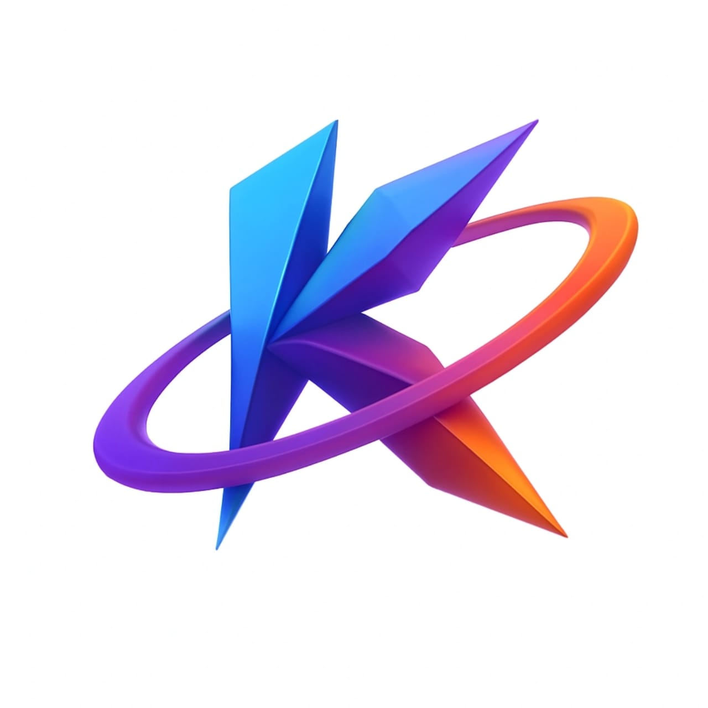

# 💰 Kora Expense Tracker

<div align="center">



**A modern, feature-rich personal finance management app built with Flutter**

[](https://flutter.dev/)
[](https://dart.dev/)
[](LICENSE)
[](https://flutter.dev/)

</div>

## 🌟 Overview

Kora Expense Tracker is a comprehensive personal finance management application that helps you take control of your money. Built with Flutter, it offers a modern, intuitive interface for tracking income, expenses, and financial health across all your devices.

### ✨ Key Features

- 💳 **Multi-Account Management** - Bank, Cash, and other account types
- 📊 **Smart Analytics** - Visual charts and spending insights
- 🏷️ **Unlimited Categories** - Create custom categories and subcategories
- 📱 **Cross-Platform** - Works on Android, iOS, Web, and Desktop
- 🔒 **Privacy First** - All data stored locally on your device
- 🎨 **Modern UI** - Clean interface with dark/light theme support
- 📸 **Receipt Management** - Attach photos to transactions
- ⏰ **Precise Tracking** - Date and time for every transaction

## 🚀 Quick Start

### Prerequisites
- Flutter 3.16.0 or higher
- Dart 3.2.0 or higher
- Android Studio / VS Code (recommended)

### Installation

```bash
# Clone the repository
git clone https://github.com/korelium/kora-expense-tracker.git
cd kora-expense-tracker

# Install dependencies
flutter pub get

# Generate code
flutter packages pub run build_runner build

# Run the app
flutter run
```

### First Time Setup
1. Complete the welcome screens
2. Create your first account (Bank/Cash)
3. Add your first transaction
4. Explore the analytics and features

## 📱 Screenshots

<div align="center">

| Home Dashboard | Add Transaction | Analytics |
|:---:|:---:|:---:|
|  |  |  |

</div>

## 🏗️ Architecture

Kora Expense Tracker follows **Clean Architecture** principles with **MVVM pattern**:

- **Presentation Layer**: UI components and screens
- **Data Layer**: Models, providers, and services
- **Core Layer**: Shared utilities and constants

### Tech Stack
- **Framework**: Flutter 3.x
- **Language**: Dart
- **State Management**: Provider pattern
- **Database**: Hive (local NoSQL)
- **Architecture**: Clean Architecture + MVVM

## 📚 Documentation

Comprehensive documentation is available in the [`docs/`](docs/) folder:

- 📖 [App Overview](docs/app-overview.md) - What is Kora Expense Tracker?
- 🚀 [Quick Start Guide](docs/quick-start.md) - Get up and running in 5 minutes
- 📋 [Features Documentation](docs/features.md) - Complete feature list
- 🛠️ [Installation Guide](docs/installation-guide.md) - Detailed setup instructions
- 🏗️ [Architecture Guide](docs/architecture.md) - Technical architecture details
- 🤝 [Contributing Guide](docs/contributing.md) - How to contribute to the project

## 🎯 Features

### 💰 Financial Tracking
- Income and expense recording
- Multiple account management
- Category and subcategory organization
- Receipt image attachment
- Precise date and time tracking

### 📊 Analytics & Insights
- Spending pattern analysis
- Category-wise breakdowns
- Monthly and yearly reports
- Financial health metrics
- Savings rate calculations

### 🎨 User Experience
- Intuitive onboarding flow
- Dark/Light theme support
- Multiple currency support
- Offline functionality
- Cross-platform consistency

### 🔒 Privacy & Security
- Local data storage only
- No cloud dependencies
- Complete data control
- Secure backup system

## 🌍 Supported Platforms

- ✅ **Android** - Full feature support
- ✅ **iOS** - Full feature support
- ✅ **Linux** - Desktop version
- ✅ **Windows** - Desktop version
- ✅ **macOS** - Desktop version
- ✅ **Web** - Progressive Web App

## 🛠️ Development

### Setup Development Environment

```bash
# Install Flutter dependencies
flutter pub get

# Generate Hive adapters
flutter packages pub run build_runner build

# Run tests
flutter test

# Analyze code
flutter analyze

# Format code
dart format .
```

### Building for Production

```bash
# Android APK
flutter build apk --release

# iOS App
flutter build ios --release

# Web App
flutter build web --release

# Desktop Apps
flutter build linux --release
flutter build windows --release
flutter build macos --release
```

## 🤝 Contributing

We welcome contributions! Please read our [Contributing Guide](docs/contributing.md) for details.

### Ways to Contribute
- 🐛 **Bug Reports** - Report issues and bugs
- ✨ **Feature Requests** - Suggest new features
- 💻 **Code Contributions** - Submit pull requests
- 📚 **Documentation** - Improve docs and guides
- 🎨 **Design** - UI/UX improvements

### Getting Started
1. Fork the repository
2. Create a feature branch
3. Make your changes
4. Add tests if applicable
5. Submit a pull request

## 📄 License

This project is licensed under the MIT License - see the [LICENSE](LICENSE) file for details.

## 👥 Team

**Korelium** - Building innovative financial technology solutions

- **Website**: [korelium.com](https://korelium.com)
- **Email**: support@korelium.com
- **GitHub**: [@korelium](https://github.com/korelium)

## 🙏 Acknowledgments

- Flutter team for the amazing framework
- Hive team for the excellent local database
- Provider team for state management
- All contributors and users

## 📊 Project Status

[](https://github.com/korelium/kora-expense-tracker)
[](https://github.com/korelium/kora-expense-tracker)
[](https://github.com/korelium/kora-expense-tracker)

---

<div align="center">

**Built with ❤️ by the Korelium Team**

*Empowering Financial Freedom Through Technology*

</div>